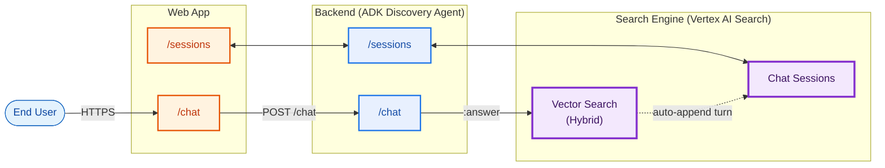

# Solution Architecture — GAP GenAI Knowledge Discovery (locked)

> **Variant**: Vertex AI Search (Discovery Engine). All other approaches retired.
> **This file** = solution architecture (whiteboard mirror). For the GCP HLD with SKUs see [High_Level_Design.md](High_Level_Design.md) and [High_Level_Design.drawio](High_Level_Design.drawio).
> **Drawio** ([GCP_RAG_Architecture.drawio](GCP_RAG_Architecture.drawio)) is the **solution-architecture data-flow view** (three peers + numbered (1)-(8) query path, (s1)-(s2) sessions, (i1)-(i4) ingest, (ev1)-(ev2) eval, (o1)-(o2) observability / cost). It is intentionally distinct from the GCP-HLD swimlane diagram in [High_Level_Design.drawio](High_Level_Design.drawio); both reflect the 2026-05-25 AI Architect review (AR-1, AR-5, AR-6, AR-7, AR-9, AR-10).
> **Detailed docs**: [Vertex_AI_Search_Variant/](Vertex_AI_Search_Variant/).

---

## 1. The shape

Three peers, mirrored: **Web App** ↔ **Backend** ↔ **Search Engine**. Each of the first two exposes a `/sessions` surface and a `/chat` surface. The Search Engine exposes **Vector Search (Hybrid)** and **Chat Sessions**. The Backend makes a single `:answer` call per turn — no LLM hop, no model router, no Opus/Gemini fallback. Conversation history lives inside VAIS, not in the app.

## 2. Per-turn path

1. User types in Web App `/chat`.
2. Web App POSTs to Backend `/chat`.
3. Backend invokes the `generate_answer` skill — one call to VAIS `:answer` with `query`, `session`, `userPseudoId`, citations enabled, and `naturalLanguageQueryUnderstandingSpec.filterExtractionCondition: ENABLED`.
4. VAIS performs query rewriting (from session history), filter extraction, hybrid retrieval, reranking, grounded synthesis, and auto-appends the turn to the session.
5. Backend formats citations, emits OTel telemetry to the Cloud Observability Suite, persists feedback/eval rows to BigQuery, and returns the answer.
6. Web App renders the answer with inline references.

## 3. Per-session-ops path

1. Web App `/sessions` calls Backend `/sessions` for list / open / delete.
2. Backend calls VAIS `sessions.list` / `sessions.get` / `sessions.delete`.
3. Backend filters the listing client-side on `userPseudoId` (the server-side `filter=` param is currently ignored by the API) and applies the owner-gate.

## 4. Periphery

- **Ingest (weekly delta)**: Cloud Scheduler → Confluence Exporter (Cloud Run Job, **read-only service-account PAT** in Secret Manager — no employee tokens, AR-1) → GCS `corpus-html` → Reindex Trigger (Cloud Run Job) → VAIS `importDocuments` against the GCS prefix.
- **Eval**: Cloud Scheduler → Vertex AI Evaluation Service, weekly golden-set run on each skill + trajectory; results land in BigQuery `eval_runs`.
- **Observability**: OTel from Backend + Web App → **Cloud Observability Suite** (Logging + Monitoring + Trace + Profiler + Error Reporting). BigQuery is **not** used as a log sink (AR-5).
- **LLM token tracking** (AR-6): Backend extracts `usageMetadata.{prompt,candidates}TokenCount` from each Vertex AI Model Garden call and the equivalent counters from VAIS `:answer.metadata`, then emits OTel attributes `llm_tokens_in`, `llm_tokens_out`, `model_id`, `skill_name`. Cloud Monitoring log-based metrics `gap_genai/llm_tokens_in`, `gap_genai/llm_tokens_out`, `gap_genai/llm_calls`, `gap_genai/llm_cost_usd` feed a finance dashboard. A **Cloud Billing — budget alerts** tile holds line-item budgets on Discovery Engine + Vertex AI; a Monitoring alert policy fires on output-token rate-of-change.
- **Identity**: Google Workspace IdP (Cloud Identity) — users authenticate with **SSO**, then access the Web App over HTTPS (AR-7). Edge enforcement (IAP on Cloud Run / CSRF) is shown in the physical + security views (D2, D5), not on this conceptual diagram.
- **Persistence (product data only)**: BigQuery `gap_genai_app` — `experiments`, `experiment_clusters`, `feedback`, `golden_evals`, `eval_runs`, `app_config.skill_registry`, `app_config.ingest_state`.
- **Security**: per-service SAs (`sa-web`, `sa-gateway`, `sa-agent`, `sa-exporter`, `sa-reindex`) least privilege; Secret Manager (Confluence **SA-PAT** only). Managed **BigQuery MCP server** (`bigquery.googleapis.com/mcp`) is Google-hosted with no SA in this project; `sa-agent` calls it via `roles/mcp.toolUser` and reads only the authorized view `v_experiment_kpis`.

## 5. Drawio source

- [GCP_RAG_Architecture.drawio](GCP_RAG_Architecture.drawio) — this same picture in draw.io
- [High_Level_Design.drawio](High_Level_Design.drawio) — same picture with GCP icons + SKU panel

## 6. Validated

Live-engine end-to-end smoke test: [tests/multi_session_smoke.ps1](tests/multi_session_smoke.ps1). Multi-user × multi-session × multi-turn anaphora × resume-with-follow-up × ACL gate — all PASS against `gap-genai-discovery-search`.
