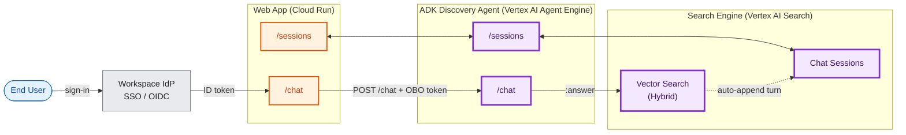

# Solution Architecture — GAP GenAI Knowledge Discovery (locked)

> **Variant**: Vertex AI Search (Discovery Engine). All other approaches retired.
> **This file** = solution architecture (whiteboard mirror). For the GCP HLD with SKUs see [High_Level_Design.md](High_Level_Design.md). The canonical HLD drawio is now [GAP_HLD_v2 (2).drawio](GAP_HLD_v2%20(2).drawio) (post 2026-06-12 GAP Infra Security review).
> **Drawio** ([GCP_RAG_Architecture.drawio](GCP_RAG_Architecture.drawio)) is the **solution-architecture data-flow view** — three peers + numbered (1)–(8) query path, (s1)–(s2) sessions, (i1)–(i4) ingest, (ev1)–(ev2) eval, (o1)–(o2) observability / cost. It is intentionally distinct from the GCP-HLD swimlane diagram in [GAP_HLD_v2 (2).drawio](GAP_HLD_v2%20(2).drawio); both reflect the 2026-05-25 AI Architect review (AR-1…AR-12) and the **2026-06-12 client infra review** (AI-1…AI-10 — see [Client_Infra_Action_Items.csv](Client_Infra_Action_Items.csv)).
> **Detailed docs**: [Vertex_AI_Search_Variant/](Vertex_AI_Search_Variant/).

---

## 1. The shape

Three peers, mirrored: **Web App** ↔ **ADK Agent (Vertex AI Agent Engine)** ↔ **Search Engine**. Each of the first two exposes a `/sessions` surface and a `/chat` surface. The Search Engine exposes **Vector Search (Hybrid)** and **Chat Sessions**. The Agent makes a single `:answer` call per turn — no LLM hop, no model router, no Opus/Gemini fallback. Conversation history lives inside VAIS, not in the app. End-to-end **OBO** carries the user identity from Workspace IdP through to AlloyDB row-level access and VAIS `userPseudoId`.

## 2. Per-turn path

1. User signs in via Workspace IdP (OIDC); Web App receives an ID token.
2. User types in Web App `/chat`.
3. Web App POSTs to Agent Engine `/chat` with the OBO token (token exchange against the user's ID token).
4. Agent invokes the `generate_answer` skill — one call to VAIS `:answer` with `query`, `session`, `userPseudoId` (derived from the user's email hash), citations enabled, and `naturalLanguageQueryUnderstandingSpec.filterExtractionCondition: ENABLED`.
5. VAIS performs query rewriting (from session history), filter extraction, hybrid retrieval (text + image, multimodal embedding via `gemini-embedding-2`), reranking, grounded synthesis, and auto-appends the turn to the session.
6. If the question is a KPI lookup, the agent additionally calls `query_experiment_kpis` against AlloyDB (`gap-genai-app-alloydb`) over the AlloyDB AuthProxy with **IAM database authentication** — the user's identity authorises row access; no service-account impersonation.
7. Agent formats citations, emits OTel telemetry to the Cloud Observability Suite, persists feedback / eval rows to AlloyDB, and returns the answer.
8. Web App renders the answer with inline references.

## 3. Per-session-ops path

1. Web App `/sessions` calls Agent Engine `/sessions` for list / open / delete.
2. Agent calls VAIS `sessions.list` / `sessions.get` / `sessions.delete`.
3. Agent filters the listing client-side on `userPseudoId` (the server-side `filter=` param is currently ignored by the API) and applies the owner-gate.

## 4. Periphery

- **Ingest (weekly delta)**: **Cloud Composer (Airflow)** DAG `confluence_weekly_ingest` — tasks `fetch_changed_pages` (read-only **service-account PAT** in Secret Manager — no employee tokens, AR-1) → `extract_text` → `extract_images` (Phase 1, AR-2/3/4) → `upload_gcs` (`gs://…/pages/`, `gs://…/images/`) → `trigger_vais_reindex` (`importDocuments` against the GCS prefix) → `write_experiment_rows` to AlloyDB. **Replaces the previous Cloud Run Job + Cloud Scheduler combo** per the 2026-06-12 review (AI-1).
- **Eval**: Cloud Composer (or Cloud Scheduler) → **Vertex AI Gen AI Evaluation Service**, weekly golden-set run on each skill + trajectory; metrics faithfulness / answer-relevance / context-precision / citation-coverage; results land in AlloyDB `eval_runs`. Never gates production traffic. Refs: <https://cloud.google.com/vertex-ai/generative-ai/docs/models/evaluation-overview>, <https://cloud.google.com/vertex-ai/generative-ai/docs/models/online-pairwise-evaluation> (AI-10).
- **Observability**: OTel from Web App + Agent Engine + Composer → **Cloud Observability Suite** (Logging + Monitoring + Trace + Profiler + Error Reporting) — the **GAP standard OTel pipeline** (AI-9). BigQuery is **not** used as a log sink (AR-5).
- **LLM token tracking** (AR-6): Agent extracts `usageMetadata.{prompt,candidates}TokenCount` from each Vertex AI Model Garden call and the equivalent counters from VAIS `:answer.metadata`, then emits OTel attributes `llm_tokens_in`, `llm_tokens_out`, `model_id`, `skill_name`. Cloud Monitoring log-based metrics `gap_genai/llm_tokens_in`, `gap_genai/llm_tokens_out`, `gap_genai/llm_calls`, `gap_genai/llm_cost_usd` feed a finance dashboard. A **Cloud Billing — budget alerts** tile holds line-item budgets on Discovery Engine + Vertex AI; a Monitoring alert policy fires on output-token rate-of-change.
- **Identity & OBO** (AI-6, AI-7): Google Workspace IdP (Cloud Identity) — single role for P1 (group **`gap-genai-knowledge-discovery-users@gap.com`**, final DN per IAM team). End-to-end OBO chain: IdP → Web App ID token → token exchange → Agent Engine inherits identity → AlloyDB IAM database authentication + VAIS `userPseudoId`. No SA impersonation for user-initiated requests.
- **Persistence (product data only)**: **AlloyDB Postgres** `gap-genai-app-alloydb` — `experiments`, `experiment_clusters`, `feedback`, `golden_evals`, `eval_runs`, `app_config.skill_registry`, `app_config.ingest_state`. Replaces BigQuery `gap_genai_app` per AI-5 (BigQuery MCP not approved; AlloyDB already PSEC-approved).
- **Models** (AI-4): `gemini-3.5-flash` (primary), `gemini-2.5-pro` (complex synthesis), `gemini-embedding-2` (multimodal embeddings for Phase-1 image grounding). Submitted for Model Garden policy verification.
- **CI/CD** (AI-8): **GitHub Actions / DevSecOps Golden Path** — Cloud Build dropped. Single mono-repo (URL TBD), Workload Identity Federation, no long-lived SA keys.
- **Security**: per-service SAs (`sa-web`, `sa-composer-ingest`, `sa-agent-engine`) least privilege; Secret Manager (Confluence **SA-PAT** only). **BigQuery MCP server removed** — not approved by GAP Infra (2026-06-12).

## 5. Drawio source

- [GCP_RAG_Architecture.drawio](GCP_RAG_Architecture.drawio) — this same picture in draw.io
- [GAP_HLD_v2 (2).drawio](GAP_HLD_v2%20(2).drawio) — same picture with GCP icons + SKU panel (canonical HLD post 2026-06-12 infra review)

## 6. Validated

Live-engine end-to-end smoke test: [tests/multi_session_smoke.ps1](tests/multi_session_smoke.ps1). Multi-user × multi-session × multi-turn anaphora × resume-with-follow-up × ACL gate — all PASS against `gap-genai-discovery-search`.
