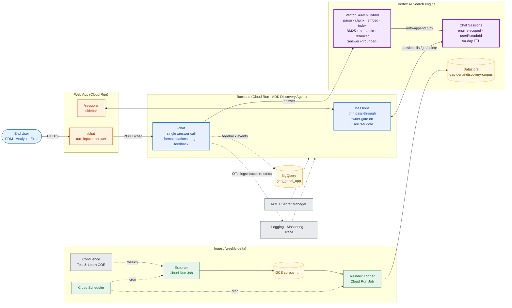

# High-Level Design — GAP GenAI Knowledge Discovery (locked)

> **Variant**: Vertex AI Search (Discovery Engine). All other approaches (custom Vertex pipeline, managed RAG Engine, vectorless RAG) have been retired.
> **Detailed docs**: see [Vertex_AI_Search_Variant/](Vertex_AI_Search_Variant/) — `README.md`, `Architecture.md`, `Multi_Session_Flow.md`.
> **Diagrams**: [High_Level_Design.drawio](High_Level_Design.drawio) (GCP HLD with SKUs) and [GCP_RAG_Architecture.drawio](GCP_RAG_Architecture.drawio) (solution architecture, whiteboard mirror).

---

## 1. Architecture at a glance

## 2. Service table

| Service | Role |
|---------|------|
| **Cloud Run — Web App** | `/sessions` sidebar + `/chat` surface. Calls the Backend only. |
| **Cloud Run — Backend (ADK Discovery Agent)** | `/sessions` (thin pass-through to VAIS, owner-gated on `userPseudoId`) and `/chat` (single VAIS `:answer` call, then format citations + emit OTel telemetry). No app-side LLM. Skills: `generate_answer`, `format_citations`, `record_feedback`, `list_sessions`, `delete_session`. |
| **Vertex AI Search engine** `gap-genai-discovery-search` | Hybrid retrieval (BM25 + semantic + reranker), grounded synthesis (`:answer` API), filter extraction (`naturalLanguageQueryUnderstandingSpec`), chat-session memory (engine-scoped, `userPseudoId`-keyed, 90-day TTL). Enterprise + LLM add-on tier. |
| **VAIS Datastore** `gap-genai-discovery-corpus` | GCS-unstructured, HTML, points at `gs://gap-genai-discovery-corpus-html/pages/`. |
| **Cloud Run Job — Exporter** | Weekly delta from Confluence Test & Learn COE → HTML to GCS. |
| **Cloud Run Job — Reindex Trigger** | Weekly `importDocuments` against the GCS prefix. |
| **Cloud Scheduler** | Drives both weekly jobs + weekly eval run. |
| **GCS bucket** `gap-genai-discovery-corpus-html` | Standard class, CMEK encrypted, versioning ON. |
| **BigQuery** `gap_genai_app` | Product data only: `experiments`, `experiment_clusters`, `feedback` (thumbs up/down events), `golden_evals`, `eval_runs`, `app_config.*`. Partitioned daily on `event_ts`. Operational telemetry (request logs, traces, latency, token usage) lives in the Cloud Observability Suite, not BigQuery — see AR-5 below. |
| **Vertex AI Evaluation Service** | Weekly golden-set run (answer quality per skill + trajectory). |
| **Cloud Observability Suite** | Primary telemetry store: Cloud Logging (structured JSON), Cloud Monitoring (SLOs, alerting, dashboards), Cloud Trace (OTel + ADK trace exporter), Cloud Profiler, Error Reporting. Log-based metrics for `request_count`, `latency_p95`, `model_id`, **`llm_tokens_in/out` per model** (finance / cost reporting). 30-day default retention; long-tail to Cloud Storage cold bucket if required. |
| **Cloud IAM + Secret Manager** | Per-service SA (least privilege); **Confluence read-only service-account PAT** (no employee tokens) in Secret Manager. |

## 3. Key design decisions

| Decision | Rationale |
|---|---|
| VAIS owns retrieval + synthesis + sessions | Three managed surfaces vs three custom services. Same single network hop. |
| No app-side LLM call | Removes Model Router, Opus/Gemini fallback service, and prompt-template maintenance. |
| GCS-staged corpus (not Google's Confluence connector) | Decouples query traffic from Confluence outages; full control of ACL tags per page. |
| Backend = ADK skills | Each step is versioned + has a golden-eval slice; swap or A/B without redeploy. |
| `:answer` on v1beta | `naturalLanguageQueryUnderstandingSpec` is only on v1beta. Rewriting is automatic when `session` is set — don't pass `queryRewritingSpec`. |
| Sessions are engine-scoped | Datastore-scoped sessions return 400 on `:answer`. |
| `sessions.list` filtered client-side on `userPseudoId` | Server-side `filter=` is currently ignored by the API. |

## 4. Validation

End-to-end smoke test against the live engine in [tests/multi_session_smoke.ps1](tests/multi_session_smoke.ps1) — verifies multi-user, multi-session, multi-turn anaphora, resume-with-follow-up, cross-user isolation, and ACL gate. Last run: 11/12 turns successful (1 cosmetic em-dash encoding failure), all five architectural validations PASS.

---

## 5. Action items � AI Architect Review (2026-05-25)

> Source: Biswajeet Mishra (AI Architect) review session. Decisions already reflected in this document and in `High_Level_Design.drawio` v2 are marked **DONE**. Open items are tracked here until the next ARB review.

| ID | Action | Owner | Type | Status |
|----|--------|-------|------|--------|
| AR-1 | Replace employee Confluence PAT with a dedicated **read-only service-account PAT**; rotate via Secret Manager. Diagram + docs already updated; provisioning to be completed before pilot. | Ashiq | Decision | OPEN (impl pending) |
| AR-2 | Phase-1 assumption: **images / diagrams are NOT processed** (text only). Call this out explicitly to the client and in the assumptions list. | Ashiq | Assumption | OPEN |
| AR-3 | Phase-2 plan: save images to GCS + retrieve based on user queries. | Ashiq | Roadmap | OPEN |
| AR-4 | Spike � run a Confluence page with embedded images through VAIS `:answer` and report whether it handles them out-of-the-box. | Ashiq | Spike | OPEN |
| AR-5 | **Cloud Observability Suite** replaces BigQuery as the logging / tracing / metrics store. BigQuery keeps only product data (`experiments`, `clusters`, `feedback`, `golden_evals`, `eval_runs`, `app_config.*`). | Ashiq / Architect | Decision | **DONE** (HLD v2) |
| AR-6 | Track LLM **token consumption + per-model usage** for finance cost reporting. Implement as log-based metrics + monthly billing export. Backend extracts `usageMetadata.{prompt,candidates}TokenCount` from every Vertex AI / VAIS call and emits OTel attributes `llm_tokens_in`, `llm_tokens_out`, `model_id`, `skill_name`; Cloud Monitoring log-based metrics `gap_genai/llm_tokens_in`, `gap_genai/llm_tokens_out`, `gap_genai/llm_calls`, `gap_genai/llm_cost_usd` feed a finance dashboard + Cloud Billing line-item budget alert on Discovery Engine + Vertex AI, plus a Monitoring alert on output-token rate-of-change. | Ashiq | Decision | **DONE** (HLD v2) |
| AR-7 | Use **VAIS native session APIs** (`sessions.create/list/delete`) directly; no custom backend session store. | Ashiq | Decision | **DONE** (variant locked) |
| AR-8 | Investigate **ADK agent API endpoint customisation** � confirm whether any backend modifications are needed for the integration. | Backend lead | Spike | OPEN |
| AR-9 | Dashboard frontend = **React** (Streamlit dropped from scope). | Frontend lead | Decision | **DONE** (Frontend_Developer_Guide) |
| AR-10 | Reflect **IAM roles / CSRF tokens / service accounts** on the diagrams so ARB reviewers can answer security questions without follow-up. | Ashiq, Nilim | Documentation | **DONE** (HLD v2 + D2 / D5) |
| AR-11 | Upload HLD + LLDs (`Vertex_AI_Search_Variant/` + `arch-meeting/D2`�`D5`) to the **Confluence ARB review page**. | Ashiq, Nilim | Documentation | OPEN |
| AR-12 | Clarify **ARB-reviewer document-set requirements** (which doc, which audience, which depth) before LLD authoring begins. | Kaushik / Architect | Open question | OPEN |

### Diagram changes captured in `High_Level_Design.drawio` v2
- **Observability Suite** tile replaces the old "Cloud Logging + Monitoring" tile; OTel arrows fan in from every Cloud Run service and Job (AR-5, AR-6).
- BigQuery cylinder no longer lists `request_logs` / `skill_invocations`; now shows product data only (AR-5).
- New **Google Workspace IdP** ellipse inserted between Users and the Web App for **SSO sign-in** (OIDC). Users authenticate with SSO, then access the Web App over HTTPS (AR-10). IAP-on-Cloud-Run / CSRF details intentionally kept out of the conceptual diagram — they live in the physical / security views (D2, D5).
- Confluence tile labelled **`Read-only service-account PAT (no employee tokens)`**; exporter tile now shows `auth: SA PAT from Secret Manager` (AR-1).
- **Secret Manager**, **Cloud IAM**, and **Vertex AI Evaluation** tiles (previously orphans in the Shared Platform lane) are now wired to their consumers with labelled edges.
- **LLM token-tracking chain surfaced on the diagram** (AR-6): the `Backend → Vertex AI Model Garden` edge is labelled `Gemini inference / ← usageMetadata / {prompt,candidates}TokenCount` and the `Backend → VAIS` edge is labelled `top-10 retrieval / ← :answer.metadata / (token counters)`. The Observability tile now lists the four log-based metric names (`gap_genai/llm_tokens_in`, `…_out`, `…_calls`, `…_cost_usd`), the backend OTel edge label calls out `llm_tokens_in / llm_tokens_out / model_id / skill_name`, and a new **Cloud Billing — budget alerts** tile is wired from Observability via a `log-based metric → budget + alert policy` dashed edge.

> The previous `High_Level_Design.drawio` is preserved as `High_Level_Design.legacy.drawio` until ARB sign-off, then it will be deleted.
