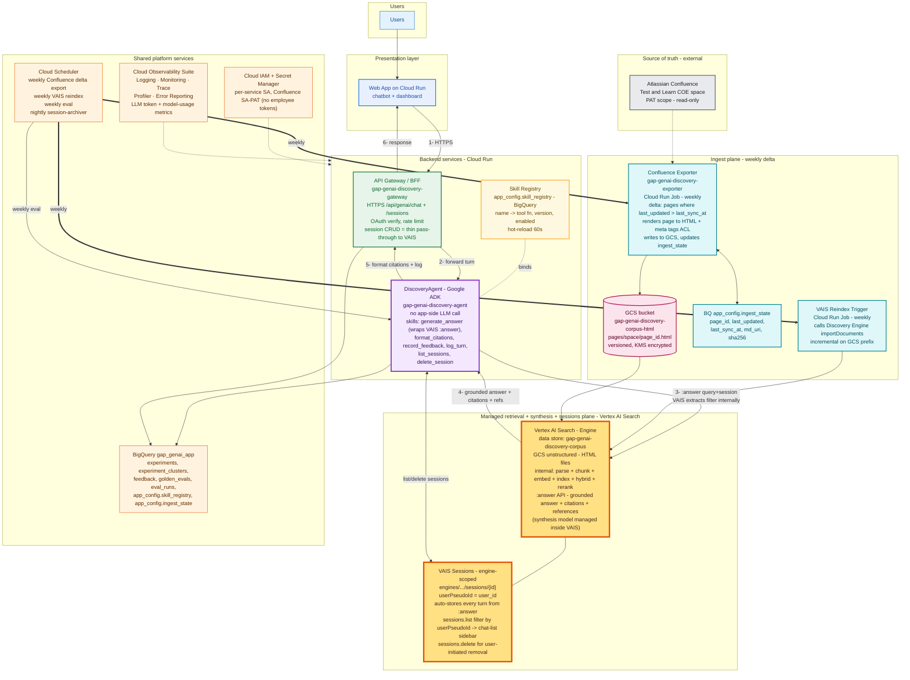

# Architecture — GenAI Knowledge Discovery

> **Retrieval + synthesis plane**: **Vertex AI Search** over a **GCS-hosted HTML corpus**. Confluence pages are exported to HTML on a **weekly delta** cadence; VAIS handles parse, chunk, embed, index, hybrid + rerank, **conversational sessions, grounded answer generation, citations and references** via the **`:answer` API**.
>
> **Orchestration**: a single **Google ADK** root agent (`DiscoveryAgent`). Every step (generate answer, format citations, feedback, log, session list/delete) is a named, versioned **skill** with its own input/output schema and golden-eval slice. **No app-side LLM call** — query understanding, filter extraction, retrieval and synthesis all run inside VAIS `:answer` (`naturalLanguageQueryUnderstandingSpec.filterExtractionCondition: ENABLED`, `queryRewritingSpec` enabled).
>
> **Sessions**: **VAIS-native sessions** (engine-scoped `sessions` resource keyed by `userPseudoId`); multiple concurrent sessions per user via `sessions.list?filter=userPseudoId=...`; `sessions.delete` for user-initiated removal.
>
> **Eval**: **Vertex AI Evaluation Service** (answer quality, per-skill) + **Agent Engine Evaluation** (trajectory).

---

## 1. Solution architecture



**Legend**

| Colour | Layer | Purpose |
|---|---|---|
| 🔵 Blue (light) | Users | End users |
| 🔵 Blue | Presentation | Cloud Run Web App |
| 🟢 Green | API Gateway / BFF | Cloud Run — HTTPS entry, auth, rate limit; thin pass-through for session CRUD |
| 🟣 Purple | DiscoveryAgent (ADK) | Cloud Run — single root agent, owns all skills; **no app-side LLM call** (VAIS handles NL understanding + filter extraction internally) |
| 🟡 Yellow | Skill Registry | BigQuery-backed config: name → tool fn, version, enabled |
| 🟠 **Amber (highlighted)** | **Managed retrieval + synthesis + sessions plane** | Vertex AI Search **engine** — GCS unstructured data store + `:answer` API + engine-scoped `sessions` resource (multi-session per user via `userPseudoId`) |
| 🩵 Cyan | **Ingest plane (weekly delta)** | Confluence Exporter (Cloud Run Job) + VAIS Reindex Trigger + `ingest_state` table |
| 🩷 Pink | **GCS corpus bucket** | `gap-genai-discovery-corpus-html` — HTML files VAIS indexes from |
| ⚪ Grey | Source | Confluence (read by Exporter via PAT) |
| 🟡 Orange (light) | Shared platform | BigQuery, Scheduler, IAM/Secrets, Observability |

**Numbered per-turn flow (1 → 6)**: Web → Gateway → Agent (1–2). Agent makes a **single `:answer` call** to VAIS passing `query.text` + `session` with `naturalLanguageQueryUnderstandingSpec.filterExtractionCondition=ENABLED` and `queryRewritingSpec` enabled (3). VAIS internally rewrites the query, extracts structured filters from natural language, runs hybrid retrieval + rerank, generates a grounded answer with citations, and auto-appends the turn to the session (4). Agent formats citations and writes logs (5); Gateway returns to Web (6). Conversation memory lives entirely in VAIS — no separate session service to operate, no app-side LLM call.

**Ingest flow (weekly, out-of-band)**: Cloud Scheduler → **Confluence Exporter** (Cloud Run Job) reads `ingest_state.last_sync_at`, pulls Confluence pages whose `last_updated >` that watermark, renders each to HTML with per-field `<meta>` tags + JSON-LD for ACL and document metadata, writes `pages/<space>/<page_id>.html` to the **GCS corpus bucket**, updates `ingest_state`. Cloud Scheduler then triggers the **VAIS Reindex Trigger** Cloud Run Job which calls `documents.import` on the GCS prefix together with a `metadata.jsonl` sidecar containing the `structData` for each document — VAIS handles parse + chunk + embed + index + rerank internally. No daily cadence; deltas land **once per week** (configurable).

---

## 2. Agent (Google ADK)

| Agent | ADK type | Default model | Responsibility | Owned skills |
|---|---|---|---|---|
| **`DiscoveryAgent`** | `Agent` (root, no sub-agents) | n/a (no app-side LLM) | Call VAIS `:answer` (NL understanding + filter extraction + retrieval + synthesis + citations + session-append in one managed call); format citations; manage session sidebar; log telemetry | `generate_answer`, `format_citations`, `record_feedback`, `log_turn`, `list_sessions`, `delete_session` |

> Session continuity is held **inside Vertex AI Search**. Gateway forwards `(user_id, session_id)` — `user_id` is mapped to VAIS `userPseudoId`, `session_id` is the VAIS session resource name. The Agent passes `session` to every `:answer` call and VAIS appends the turn automatically. No `VertexAiSessionService`, no `append_event` plumbing, no archival job.

---

## 3. Skill catalog

Skills are the atomic unit of work. Each is a typed Python function (ADK tool) with: name, model binding, input/output schema, version, enabled flag, golden-eval slice.

| # | Skill | Model | What it does | Notes |
|---|---|---|---|---|
| S1 | `generate_answer` | **n/a (managed — VAIS `:answer`)** | Single call to `engines/{engine}/servingConfigs/default_search:answer` passing `query.text` + `session` + `queryUnderstandingSpec` (`queryRewritingSpec` enabled, `naturalLanguageQueryUnderstandingSpec.filterExtractionCondition=ENABLED`) + `answerGenerationSpec.includeCitations=true`. VAIS internally rewrites the query, extracts filters from NL, runs hybrid retrieval + rerank, generates a grounded answer with citation markers, and appends the turn to the session. Returns `answerText`, `citations[]`, `references[]`, `queryUnderstandingInfo` (extracted filter visible for telemetry) | Replaces the old plan_query + extract_query_filters + retrieve_passages + synthesize_answer chain |
| S2 | `format_citations` | n/a (deterministic) | Map VAIS `citations[].sources[].referenceId` → `references[].chunkInfo.documentMetadata.structData.confluence_url` and inline `[n]` markers in `answerText` | Pure post-process |
| S3 | `record_feedback` | n/a | Write a `feedback` row to BigQuery | Called from the UI thumbs widget via Gateway |
| S4 | `emit_turn_telemetry` | n/a | Emit OTel structured-log + trace span for the turn (skill_name, session_id, user_id, latency_ms, llm_tokens_in/out, model_id, VAIS-extracted filter) into the Cloud Observability Suite. Log-based metrics drive dashboards + alerting. | Always-on — replaces the old `log_turn`/`request_logs` BQ write pattern (AR-5) |
| S5 | `list_sessions` | n/a (managed — VAIS) | `GET engines/{engine}/sessions?filter=userPseudoId="<user_id>"` and returns `[{session_id, title, last_active, turn_count}]` for the chat-list sidebar | Read-only; ACL enforced by `userPseudoId` filter |
| S6 | `delete_session` | n/a (managed — VAIS) | `DELETE engines/{engine}/sessions/{session_id}` after verifying the session's `userPseudoId` matches the caller | User-initiated |

### 3.1 Skill Registry schema (`app_config.skill_registry`)

```
skill_name           STRING   NOT NULL   -- 'generate_answer', 'list_sessions', ...
owning_agent         STRING   NOT NULL   -- 'discovery'
model_binding        STRING              -- 'vais://answer' | NULL  (no app-side LLM bindings)
tool_module          STRING   NOT NULL   -- 'skills.discovery.generate_answer'
version              STRING   NOT NULL   -- semver
input_schema         JSON     NOT NULL
output_schema        JSON     NOT NULL
enabled              BOOL     NOT NULL
golden_slice_tag     STRING              -- joins to golden_evals.slice_tag
updated_at           TIMESTAMP
```

> The registry is hot-reloaded every 60s by the Agent service: skills can be enabled/disabled, versioned, or repointed to a different model with no redeploy.

---

## 4. Components

| # | Component | Hosted on | Owns |
|---|---|---|---|
| C1 | **Web App** (`gap-genai-discovery-web`) | Cloud Run | Chatbot + dashboard UI; **chat-list sidebar** (resume / delete / new chat) |
| C2 | **API Gateway / BFF** (`gap-genai-discovery-gateway`) | Cloud Run | HTTPS entry `/api/genai/*`; OAuth verify (Workspace `gap.com`); **creates a VAIS session on `POST /sessions` and returns the resource name**; propagates `(user_id, session_id)` to Agent as headers; rate limit; feedback ingest; exposes `GET /sessions` + `DELETE /sessions/{id}` (delegated to Agent skills S5/S6 which call VAIS natively) |
| C3 | **ADK Agent Service** (`gap-genai-discovery-agent`) | Cloud Run | ADK runtime running `DiscoveryAgent`; loads skills from registry on boot + every 60s; emits per-skill telemetry. **No outbound LLM call** — the only outbound call per turn is VAIS `:answer` with NL understanding + filter extraction enabled |
| C4 | **Skill Registry** | BigQuery `app_config.skill_registry` | Authoritative list of skills, model binding, version, enabled flag |
| C5 | **Vertex AI Search — Engine** (`gap-genai-discovery-search`) | Discovery Engine (managed) | **Single managed plane** for retrieval + synthesis + sessions. Data store `gap-genai-discovery-corpus` over `gs://gap-genai-discovery-corpus-html/pages/`; ACL labels read from HTML `<meta>` tags + JSON-LD; internal parse + chunk + embed + index + hybrid (BM25 + semantic) + rerank; exposes **`:search`**, **`:answer`** (grounded answer + citations + references), and **`sessions.{create,list,get,delete}`** (engine-scoped, keyed by `userPseudoId`). Search tier: Enterprise + LLM Add-on |
| C6 | **BigQuery `gap_genai_app`** | shared dataset | Product data only: `experiments`, `experiment_clusters`, `feedback`, `golden_evals`, `eval_runs`, `app_config.skill_registry`, `app_config.ingest_state`. Operational telemetry (request logs, traces, latency, token usage) lives in the **Cloud Observability Suite**, not BigQuery (AR-5). |
| C7 | **Cloud Scheduler** | shared | (a) **Weekly Confluence delta export** (Mon 02:00 PT) → triggers C10 Exporter; (b) **Weekly VAIS reindex** (Mon 03:00 PT) → triggers C11 Reindex Trigger; (c) Weekly eval (Sun 04:00 PT) — e2e + per-skill + trajectory; (d) **Nightly session-pruner** Cloud Run Job — calls `sessions.list` + `sessions.delete` for sessions idle &gt; 90d |
| C8 | **Cloud Observability Suite** | shared | Cloud Logging (structured JSON) + Cloud Monitoring (SLOs / alerts / dashboards) + Cloud Trace (OTel + ADK trace exporter) + Cloud Profiler + Error Reporting. Per-skill + per-service latency, citation rate, **ingest freshness** (max page-age since `last_sync_at`), VAIS `:answer` p95, and **LLM token + model-usage metrics** (cost reporting, AR-6) — Backend extracts `usageMetadata.{prompt,candidates}TokenCount` from every Vertex AI call and the equivalent counters from VAIS `:answer.metadata`, surfaced as log-based metrics `gap_genai/llm_tokens_in`, `gap_genai/llm_tokens_out`, `gap_genai/llm_calls`, `gap_genai/llm_cost_usd`. A Cloud Billing line-item budget alert (Discovery Engine + Vertex AI) plus a Monitoring alert on output-token rate-of-change complete the cost-guard chain. 30-day default retention. |
| C9 | **Cloud IAM + Secret Manager** | shared | Per-service SA (`sa-gateway`, `sa-agent`, `sa-exporter`, `sa-reindex`); **Confluence read-only service-account PAT** in Secret Manager — no employee tokens (AR-1). No third-party LLM keys required. |
| C10 | **Confluence Exporter** (`gap-genai-discovery-exporter`) | Cloud Run **Job** | **Weekly delta**: reads `app_config.ingest_state.last_sync_at`, calls Confluence REST for pages where `version.when > last_sync_at`, renders each to HTML (storage-format → sanitised HTML5), writes ACL labels + page metadata as per-field `<meta>` tags + a `<script type="application/ld+json">` block, uploads to `gs://gap-genai-discovery-corpus-html/pages/<space>/<page_id>.html`, appends a row to the `metadata.jsonl` manifest, updates `ingest_state`. Soft-deletes HTML files for pages deleted in Confluence. Idempotent on re-run via `sha256` skip |
| C11 | **VAIS Reindex Trigger** (`gap-genai-discovery-reindex`) | Cloud Run **Job** | Calls Discovery Engine `documents.import` (incremental mode) on the GCS prefix together with the `metadata.jsonl` sidecar once the Exporter run completes; records `import_operation_id` for monitoring |
| C12 | **GCS Corpus Bucket** — `gap-genai-discovery-corpus-html` | Cloud Storage | Versioned, CMEK-encrypted bucket holding the rendered HTML corpus + `metadata.jsonl` manifest; lifecycle policy retains 30 days of object versions; uniform bucket-level access; readable only by `sa-exporter` (write) and the VAIS service account (read) |

> **Services dropped vs. prior revisions**: Model Router, Vertex AI Model Garden node (Opus/Gemini-for-synthesis), Vertex AI Agent Engine — Sessions, session-archiver, and the in-process Gemini 2.5 Pro calls for `plan_query` / `extract_query_filters` (VAIS does this natively via `naturalLanguageQueryUnderstandingSpec`). **Net result: 2 Cloud Run services instead of 3; 1 managed plane instead of 3; 1 outbound call per turn (`:answer`) instead of 4; no third-party LLM keys.**

---

## 5. Data flows

### 5.1 Ingest (weekly delta, GCS-backed)

```
Cloud Scheduler (Mon 02:00 PT)
  └▶ Confluence Exporter Cloud Run Job  [sa-exporter]
        ├▶ read app_config.ingest_state -> last_sync_at
        ├▶ Confluence REST: GET pages where version.when > last_sync_at
        ├▶ for each page:
        |     - render storage-format -> sanitised HTML5
        |     - inject per-field <meta> tags:
        |         page_id, space, title, confluence_url,
        |         last_updated, acl_principals,
        |         brand, value_stream, channel, primary_kpi, outcome,
        |         learning_snippet,        # Meeting 4 §7: 1-2 line learning / recommendation rendered on every result card
        |         confluence_labels,       # low-confidence; do NOT use as a hard filter (Meeting 4 §8)
        |         ...
        |     - inject <script type="application/ld+json"> with full struct
        |     - sha256(html) -> skip if unchanged
        |     - write gs://gap-genai-discovery-corpus-html/pages/<space>/<page_id>.html
        |     - append row to metadata.jsonl  (id, structData, content.uri)
        |     - upsert ingest_state(page_id, last_updated, last_sync_at=now, html_uri, sha256)
        ├▶ reconcile deletes: pages in ingest_state not in Confluence -> tombstone html file
        └▶ emit ingest_run row (run_id, pages_changed, pages_deleted, bytes_written)

Cloud Scheduler (Mon 03:00 PT)
  └▶ VAIS Reindex Trigger Cloud Run Job  [sa-reindex]
        ├▶ Discovery Engine documents.import (incremental on GCS prefix + metadata.jsonl)
        ├▶ poll import operation -> success / partial / failed
        └▶ emit reindex_run row (operation_id, docs_imported, docs_failed, duration)

Vertex AI Search
  └▶ internal: parse HTML -> chunk -> embed -> index -> serve via Search / Answer API
        (<meta name="acl_principals"> mapped to data-store doc-level ACLs)
```

### 5.2 Query (per chat turn — single managed call)

```
User -> Web App -> API Gateway (auth, session_id, rate limit) -> ADK DiscoveryAgent
  |
  +-> skill: generate_answer(                          [managed - VAIS :answer]
  |       query.text=user_text,
  |       session=<engines/.../sessions/{session_id}>,
  |       queryUnderstandingSpec={
  |         queryRewritingSpec: { disable: false },
  |         naturalLanguageQueryUnderstandingSpec: {
  |           filterExtractionCondition: 'ENABLED'
  |         }
  |       },
  |       answerGenerationSpec.includeCitations=true)
  |     # VAIS internally:
  |     #   - reads session history -> resolves anaphora ("the returned results")
  |     #   - rewrites query (typos, expansions)
  |     #   - extracts structured filter from NL
  |     #     (e.g. "Old Navy wins in 2025" -> brand:ANY("Old Navy") AND outcome:ANY("Win") AND ...)
  |     #   - hybrid retrieve + rerank over chunks matching filter
  |     #   - grounded synthesis with citation markers
  |     #   - assembles references[] from document_metadata.structData
  |     #   - appends this turn to the session (no client-side append_event)
  |     -> { answerText, citations[], references[],
  |          queryUnderstandingInfo.structuredExtractedFilter,  // visible for telemetry
  |          session.queryId }
  |
  +-> skill: format_citations(answerText, citations, references)
  |     -> markdown with inline [n] markers and clickable confluence URLs
  |
  +-> skill: emit_turn_telemetry(...)                  [deterministic]
  |     -> OTel structured-log + trace span -> Cloud Observability Suite
  |        (skill_name, session_id, user_id, latency_ms, llm_tokens_in/out,
  |         model_id, VAIS-extracted filter for analytics + drift detection)
  |     (no separate session append - VAIS already persisted the turn)
  |
  +-> response -> Gateway -> Web App -> user
```

### 5.3 Eval (weekly + on-demand) — per-skill, end-to-end, **and trajectory**

```
Cloud Scheduler (Sun 04:00 PT) OR Admin endpoint
  └─▶ Vertex AI Evaluation Service (answer-quality)
  |     ├─▶ End-to-end eval: run golden user-turns through full DiscoveryAgent
  |     |     judge = Gemini 2.5 Pro (managed): groundedness, answer_relevance,
  |     |                                        citation_accuracy
  |     |
  |     └─▶ Per-skill eval: for each registered skill with a golden_slice_tag
  |           ├─▶ generate_answer            -> groundedness + citation_accuracy + recall@k
  |           |                                (single managed VAIS :answer call —
  |           |                                 this is the e2e quality signal too)
  |           ├─▶ vais_filter_extraction     -> structured-match F1 of
  |           |                                queryUnderstandingInfo.structuredExtractedFilter
  |           |                                vs labelled gold filter
  |           |                                (tracks VAIS NL understanding accuracy without
  |           |                                 us owning the extraction step)
  |           └─▶ format_citations           -> exact-match URL mapping
  |
  └─▶ Agent Engine — Evaluation (trajectory / agent-trace eval)
        ├─▶ replays golden multi-turn sessions through the deployed agent
        ├─▶ scores TOOL-CHOICE correctness (right skill picked?) and
        |   TOOL-SEQUENCE correctness (skills called in right order?)
        └─▶ catches regressions our answer-quality eval misses
              (e.g. agent calls generate_answer with a missing/wrong session_id,
               or skips format_citations on a non-empty citations[])

  -> write eval_runs row (track='vertex_ai_search', skill_name,
                          scope='e2e'|'skill'|'trajectory', trace_id, scores)
```

### 5.4 Session lifecycle (multi-turn + multi-session, VAIS-native)

```
NEW CHAT
  Web App -> POST /api/genai/sessions                                [Gateway]
    Gateway: verify OAuth
             POST engines/{engine}/sessions  body: {userPseudoId: <user_id>}
             -> returns session.name = engines/.../sessions/{session_id}
             sign cookie with session_id
             return {session_id, title=null}

FIRST + SUBSEQUENT TURNS  (see 5.2)
  Gateway forwards (user_id, session_id) as request headers.
  Agent: build session.name and pass it to VAIS :answer.
  VAIS auto-appends the turn - no client-side persistence call.

RESUME / SWITCH CHAT
  Web App sidebar -> GET /api/genai/sessions                         [Gateway -> S5 list_sessions]
    -> Agent: GET engines/{engine}/sessions?filter=userPseudoId="<user_id>"
    -> [{session_id, title, last_active, turn_count}]
        (title derived from first user turn text; cached in BQ for fast list)
  User clicks one -> Web App loads /api/genai/sessions/{id}/turns
    -> Agent: GET engines/{engine}/sessions/{session_id}?includeAnswerDetails=true
    -> render turns[] from the session resource itself.

DELETE CHAT
  Web App -> DELETE /api/genai/sessions/{id}                         [Gateway -> S6 delete_session]
    Agent: GET session, verify session.userPseudoId == caller user_id,
           then DELETE engines/{engine}/sessions/{session_id}.

PRUNE  (nightly)
  Cloud Scheduler -> Cloud Run Job 'session-pruner'
    -> sessions.list, filter where last_turn_time < now()-90d
    -> sessions.delete each (hard delete; export to BQ first if compliance retention required)
```

> **Concurrent sessions per user** are first-class via VAIS itself — `userPseudoId` is the partition key and `sessions.list?filter=userPseudoId="…"` returns every chat that user owns. No second store, no consistency model to reason about. **Session ID** is the VAIS session resource name (last path segment) and is propagated in a signed cookie + echoed in a request header so Gateway can forward it to Agent without re-parsing the cookie.
>
> **What we gave up** vs. running our own session store: we cannot store arbitrary per-turn metadata on the session object (VAIS sessions are append-only and schema-fixed to turns). We handle this by emitting `session_id` as an **OTel log/trace attribute** into the Cloud Observability Suite — joinable for any custom analytics via log-based metrics without bloating the VAIS session payload.

---

## 6. Network ports and protocols (PSEC Q23)

Every hop in the architecture above is TLS 1.2+. Only port 443 is used end-to-end. The flat list below is the PSEC-aligned restatement of the data flows in §5.

| # | Source | Destination | Protocol / Port | Direction | Auth |
|---|--------|-------------|-----------------|-----------|------|
| 1 | End-user browser | IAP (Cloud Run native) | TLS 1.2+ / 443 | Inbound (Internet) | IAP (Gap SSO via Workspace OIDC); managed TLS |
| 2 | IAP | Web App (Cloud Run) | HTTPS / 443 | Internal (Google-managed) | Cloud Run native IAP integration; IAP-injected identity header |
| 3 | Web App | API Gateway / BFF (Cloud Run) | HTTPS / 443 | Internal | IAM `run.invoker` (`sa-gateway`) |
| 4 | Gateway | ADK Agent (Cloud Run) | HTTPS / 443 | Internal | IAM `run.invoker` (`sa-gateway`) |
| 5 | ADK Agent | Vertex AI Search `:answer` (`discoveryengine.googleapis.com`) | gRPC over TLS / 443 | Outbound to Google APIs | IAM SA (`sa-agent`) |
| 6 | ADK Agent | BigQuery `gap_genai_app` (`bigquery.googleapis.com`) | HTTPS / 443 | Outbound to Google APIs | IAM SA (`sa-agent`) |
| 7 | Confluence Exporter Job | Atlassian Confluence REST | HTTPS / 443 | Outbound to Gap-corp Atlassian | Confluence **service-account PAT** (Secret Manager) — no employee tokens (AR-1) |
| 8 | Confluence Exporter Job | GCS `gap-genai-discovery-corpus-html` | HTTPS / 443 | Outbound to Google APIs | IAM SA (`sa-exporter`) |
| 9 | Reindex Trigger Job | Discovery Engine admin (`discoveryengine.googleapis.com`) | HTTPS / 443 | Outbound to Google APIs | IAM SA (`sa-reindex`) |
| 10 | All services | Cloud Logging (`logging.googleapis.com`) | HTTPS / 443 | Outbound | IAM SA (per-service) |
| 11 | Cloud Logging | Cloud Monitoring / Trace / Profiler / Error Reporting (Observability Suite) | Internal | Internal | Google-managed service agent |
| 12 | Cloud Audit Logs | Cloud Logging (`_Required` / `_Default` log buckets) | Internal | Internal | Google-managed service agent |
| 13 | ADK Agent | Managed BigQuery MCP server (`bigquery.googleapis.com/mcp`) | HTTPS / 443 (PSC) | Google-managed endpoint | OAuth2 + IAM `roles/mcp.toolUser` (`sa-agent`); Model Armor inspects payload |
| 14 | Managed BigQuery MCP server | BigQuery `gap_genai_app` (view `v_experiment_kpis`) | Google-internal | Caller-identity propagation | `sa-agent` (`bigquery.jobUser` + `bigquery.dataViewer` on view only) |
| 15 | ADK Agent | Vertex AI Model Garden - Gemini 2.5 Flash / Pro (`aiplatform.googleapis.com`) | gRPC over TLS / 443 | Outbound to Google APIs | IAM SA (`sa-agent`); response includes `usageMetadata.{prompt,candidates}TokenCount` consumed by `emit_turn_telemetry` for AR-6 |

**PSEC Q26 (non-encrypted protocols)**: **No** - every hop above is TLS 1.2+. **PSEC Q24 (Internet / non-Gap)**: **Yes** - Cloud Run web (with native IAP) is Internet-reachable so Gap analysts can connect from home / VPN / mobile; IAP enforces Gap SSO + Google-Group membership before any byte reaches the Web App.

---

## 7. Dashboard Data Agent + MCP integration (Day-1)

> **Reference architecture**: this section follows Google's [Single-agent AI system using ADK and Cloud Run](https://docs.cloud.google.com/architecture/single-agent-ai-system-adk-cloud-run) pattern. The same `DiscoveryAgent` gains one new tool path (the dashboard KPI skill) wired through the **Google-managed BigQuery MCP server** at `bigquery.googleapis.com/mcp` (no Cloud Run hop). VAIS `:answer` remains a direct ADK Built-in tool.

### 7.1 Why a new skill

The pitch Figma surfaces a dashboard view (`Recent Experiments`, `Experiment Performance Overview`) with aggregate KPI tiles - `Total Experiments Run`, `Completed`, `Successful`, `Active`, `Avg Conversion Lift`, `Total Revenue Impact`, `Avg AOV Lift`, `UPT Lift`, `Total Category Sales Impact` - plus per-experiment cards (`Category / Stores / Region / Duration / Conversion Lift / Revenue Lift / AOV Lift / Confidence / Success badge`). These are **structured aggregates** which Confluence test reports do not expose in a queryable shape, so VAIS `:answer` cannot serve them. We add a structured-query path next to the VAIS path on the same agent.

### 7.2 Component additions

| ID | Component | Hosted on | Owns |
|---|---|---|---|
| **C13** | **Managed BigQuery MCP server** (`https://bigquery.googleapis.com/mcp`) | Google-managed Google API (zero infra in our project) | Google-hosted MCP server bundled with the BigQuery API. Exposes generic MCP tools (`execute_sql_readonly`, `list_dataset`, `get_table`, ...). The ADK Agent reaches it via the **MCP client** built into ADK using `sa-agent` (OAuth2 + `roles/mcp.toolUser`). All BigQuery access is scoped to the authorized view `v_experiment_kpis` (which joins `experiments` + `experiment_clusters`); the raw tables are not granted to `sa-agent`. An IAM deny policy removes the read-write `execute_sql` MCP tool. Every call is automatically captured in Cloud Audit Logs with tag `goog-mcp-server:true`. |
| **C14** | **`experiments` + `experiment_clusters` tables** | BigQuery `gap_genai_app` (existing dataset) | Structured KPI data consumed by the dashboard. **Pipeline / ingestion is owned by another team and is out of scope for this design.** We bind the skill against the published table schema. |
| **C15** | **Vertex AI Model Garden - Gemini 2.5 Flash + Gemini 2.5 Pro** | Vertex AI (managed, `us-central1`) | The two Gemini models the agent binds for intent classification + parameter extraction (`gemini-2.5-flash`) and chained-narrative summarisation (`gemini-2.5-pro`). No custom Model-Router class - ADK `LlmAgent` natively supports per-skill model bindings; the mapping lives in the agent's source config. |

### 7.3 New skill `query_experiment_kpis`

| Field | Value |
|---|---|
| Name | `query_experiment_kpis` |
| Served by | Generic `execute_sql_readonly` MCP tool on the **Google-managed BigQuery MCP server** (`bigquery.googleapis.com/mcp`) against the authorized view `v_experiment_kpis` - no hand-rolled Python tool, no `tools.yaml` |
| Input | `{ brand?: string, value_stream?: string, region?: string, outcome?: string, time_range?: '3M' \| '6M' \| '9M' \| '12M' = '6M' }` |
| Output | `{ tiles: { total_run, completed, successful, active, avg_conversion_lift, total_revenue_impact, avg_aov_lift, upt_lift, total_category_sales_impact }, card_clusters: [{ cluster_id, name, category, stores, region, duration, conversion_lift, revenue_lift, aov_lift, confidence, success }] }` |
| Path | Backend chat handler -> ADK `DiscoveryAgent` -> MCP client -> **managed `bigquery.googleapis.com/mcp`** -> BigQuery authorized view `gap_genai_app.v_experiment_kpis` (joins `experiments` + `experiment_clusters` server-side) |
| Routing rule | Agent picks this skill when the turn matches list/show/how-many/which intent (classified by `gemini-2.5-flash`). For why/explain intent it picks `vais_answer` instead. For mixed intent it chains both and summarises with `gemini-2.5-pro`. |
| Freshness | On-demand: each dashboard load issues a fresh BigQuery query through the managed BQ MCP server. Backend caches the response per session for 5 minutes to absorb tile-refresh noise. |
| Success badge | `outcome == 'Win'` (matches the Confluence-ingested `outcome` enum). |
| Default view | If no filters present: last 6 months, all brands. |
| Card grain | A `card_cluster` is an **aggregate** across multiple Confluence tests sharing a `cluster_id`. The `experiment_clusters` table owns the cluster definition; the `experiments` table joins via `cluster_id`. |

### 7.4 Expected upstream table shape (to confirm with the data team)

```
gap_genai_app.experiments
  experiment_id           STRING   NOT NULL  -- 'TLCOE-2010225'
  cluster_id              STRING             -- FK to experiment_clusters
  brand                   STRING             -- 'Athleta' | 'Banana Republic' | 'Old Navy' | 'Gap' | 'Gap Factory' | 'BR Factory'
  value_stream            STRING             -- 'PLP' | 'PDP' | 'Bag' | 'Checkout' | 'Homepage' | 'Account' | 'Search'
  region                  STRING             -- 'US' | 'CA' | 'MX' | 'Global'
  outcome                 STRING             -- 'Win' | 'Loss' | 'Flat'
  conversion_lift         FLOAT64
  revenue_lift            FLOAT64
  aov_lift                FLOAT64
  upt_lift                FLOAT64
  confidence              FLOAT64            -- 0-100
  stores                  INT64
  start_date              DATE
  end_date                DATE
  confluence_url          STRING             -- joinable to VAIS reference cards

gap_genai_app.experiment_clusters
  cluster_id              STRING   NOT NULL
  name                    STRING             -- 'Denim Entrance Placement'
  description             STRING
  category                STRING             -- 'Product Placement' | 'Loyalty' | 'Promotion' | 'Store Experience'
```

### 7.5 Chat response shape change

`POST /api/genai/chat` now returns an optional `dashboard_payload`:

```json
{
  "answer": "... [1] [2]",
  "citations": [...],
  "references": [...],
  "dashboard_payload": {
    "tiles": { "total_run": 142, "completed": 136, "successful": 78, "active": 6,
               "avg_conversion_lift": 3.8, "total_revenue_impact": 9400000,
               "avg_aov_lift": 4.2, "upt_lift": 5.1,
               "total_category_sales_impact": 4600000 },
    "card_clusters": [
      { "cluster_id": "DEP-001", "name": "Denim Entrance Placement",
        "category": "Product Placement", "stores": 45, "region": "North America",
        "duration": "2025-08-01..2025-11-15",
        "conversion_lift": 3.6, "revenue_lift": 2.1e6,
        "aov_lift": 4.0, "confidence": 96, "success": true }
    ]
  }
}
```

`dashboard_payload` is **absent** when the agent didn't fire `query_experiment_kpis` (pure narrative turn). The frontend renders tiles + cards when it's present, narrative-only when it isn't.

### 7.6 Updated query flow (per turn)

```
User -> Web App -> Gateway -> ADK DiscoveryAgent
  +-> [intent classify | gemini-2.5-flash]
  +-> if list/show/how-many:
  |     [param extract | gemini-2.5-flash]
  |     skill: query_experiment_kpis  (MCP client -> bigquery.googleapis.com/mcp -> v_experiment_kpis)
  |       -> { tiles, card_clusters }
  +-> if why/explain:
  |     skill: generate_answer        (Built-in tool -> VAIS :answer)
  |       -> { answerText, citations, references }
  +-> if both:
  |     run both in parallel, then
  |     [chained summary | gemini-2.5-pro]   -> single coherent answer + payload
  +-> format_citations + emit_turn_telemetry (OTel log/trace with skill_name='query_experiment_kpis', llm_tokens_in/out, model_id)
  +-> response -> Gateway -> Web App
```

### 7.7 Updated component list (delta only)

> §4 components C1-C12 are unchanged. The new components in §7.2 (**C13 Managed BigQuery MCP server**, **C14 `experiments` + `experiment_clusters` tables surfaced via authorized view `v_experiment_kpis`**, **C15 Vertex AI Model Garden Gemini 2.5 Flash / Pro**) extend the runtime path; nothing in the existing VAIS ingest / answer / session flow is removed. The earlier self-hosted `mcp-toolbox-databases` Cloud Run service has been **decommissioned** — total project service-account count drops from 6 to 5.

---

## 8. Open questions (Dashboard Data Agent)

| # | Question | Owner | Notes |
|---|---|---|---|
| Q1 | Authoritative table schema for `gap_genai_app.experiments` + `gap_genai_app.experiment_clusters` | Data team that populates the dataset | §7.4 above is our placeholder; needs sign-off |
| Q2 | Is `cluster_id` populated upstream? | Data team | If no, the authorized view `v_experiment_kpis` must define a fallback grouping (recommend `value_stream + tactic + brand`) directly in its SQL |
| Q3 | Does the upstream `brand` enum match Confluence (`Athleta` / `Banana Republic` / `Old Navy` / `Gap` / `Gap Factory` / `BR Factory`)? | Data team + PM | Filter vocabulary must align for the same NL query to work across both skills |
| Q4 | Day-2 filters (`channel`, `tactic`, `vendor`, `primary_kpi`, `audience`) | PM / Brand Manager interviews | Parked; not on Day-1 critical path |
| Q5 | Persona-conditional dashboard layout? | UX / PM | Day-1 ships one shared layout for all four personas (matches Meeting 4 decision); revisit if leadership feedback demands it |
| Q6 | ~~MCP Toolbox deployment shape - standalone Cloud Run service vs sidecar in the Agent container~~ **CLOSED** | Eng | Obsolete after switch to Google-managed BigQuery MCP server at `bigquery.googleapis.com/mcp` (zero infra in our project; no Cloud Run shape to choose). |

